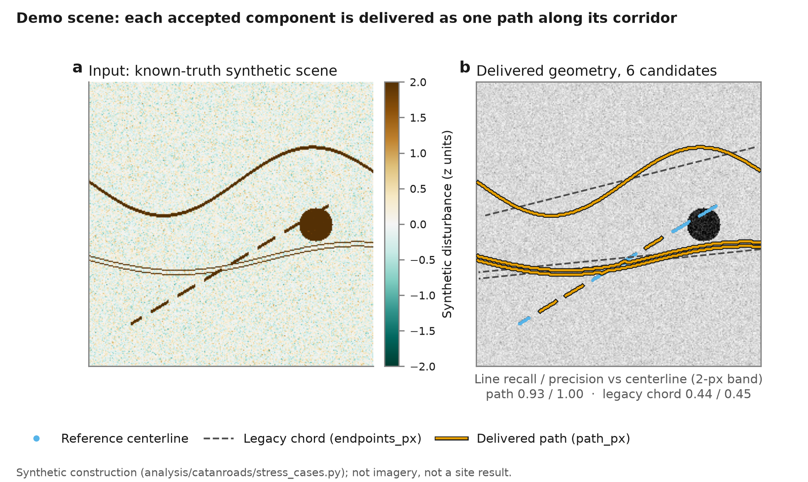

# Informal Road Mapping

Finding unmapped dirt-road corridors in Mongolia from Sentinel-2 imagery. The
method looks for ground disturbance that persists across years, checks it
against a road-free control site, and then traces line-like candidates for
comparison with dated high-resolution imagery.

The detector responds to disturbance between periods; old roads unchanged across
both periods are invisible to it.

[](https://github.com/500ft/informal-road-mapping/actions/workflows/ci.yml)

[](LICENSE)

[How it works](#how-it-works) · [Results so far](#results-so-far) ·
[Roadmap](ROADMAP.md) · [Getting started](#getting-started)



*Synthetic test scene, not satellite imagery.
[How the figure is made](docs/data-and-figures.md).*

## How it works

A change map is not a road detector. Vegetation, farming, riverbeds and
weather all produce strong change signals, and most tyre tracks are narrower
than a Sentinel-2 pixel. So the project targets corridors: wide, persistent
strips of disturbed ground.

1. **Screen** in Earth Engine. Same-season composites for 2018–2021 and
   2023–2026 are compared, using vegetation-loss and bare-soil indices, a local
   control ring around each site, and a persistence rule across years.
2. **Gate.** Before any line is extracted, a rule fixed in advance on
   2026-08-23 must pass: at least two of three development sites need twice the
   large-component fraction of a road-free negative control.
3. **Extract** elongated components from the disturbance raster in Python and
   export each as a centreline.
4. **Evaluate** against dated high-resolution imagery on the development sites
   and one untouched holdout site.

## Results so far

Everything below is synthetic or a QA run. No site has been verified and the
gate has not run.

- **Extractor stress tests.** Ten synthetic cases, each with a known
  centreline. Curved corridors that the old straight-line output missed
  (recall 0.11, 0.25, 0.44) now pass at 0.93 recall or better, with 0.99
  precision or better. It still misses crossings and dashed tracks, splits a
  faint corridor into seven pieces, and invents a road along a riverbank.
  [Details](results/README.md).
- **First Earth Engine run.** The grid probe failed on its first run, was
  fixed, and then confirmed a problem the design had predicted: the analysis
  grid is Web Mercator, so at the development site's latitude (47.3°N) a
  "10 m" pixel is 6.79 m × 6.77 m on the ground. The 50-pixel minimum component
  is therefore about 2,300 m² of ground, not 5,000 m².
  [Runtime record](results/earth_engine_runtime_2026-09-29.json).
- **Phase-1 QA exports** were submitted on the unverified sites. They test the
  pipeline only.

## Where the numbers come from

The [parameter provenance audit](docs/PARAMETER_PROVENANCE.md) sorts every
threshold into requirement, sourced assumption, design choice or estimate. Most
thresholds were fixed before any result existed, which protects the gate from
tuning, but few have a recorded reason for their specific value.

The [literature review](literature/) maps each claim in the
[design](docs/design.md) to papers that support or challenge it, through a
[claim ledger](literature/claim-ledger.md) and a [gaps list](literature/gaps.md).

## Getting started

Needs Python 3.10+ and Node.js 22 (the CI version). No Earth Engine account is
needed and no imagery is downloaded.

```sh
git clone https://github.com/500ft/informal-road-mapping.git
cd informal-road-mapping
python -m venv .venv
source .venv/bin/activate
python -m pip install -e "analysis[dev]"
PYTHONPATH=analysis python -m pytest analysis/tests -q
node tools/validate_phase1.mjs
node tools/test_temporal_qa.mjs
PYTHONPATH=analysis python -m catanroads.site_worksheet --check
```

The tests and static checks should pass, and the worksheet check should pass
without changing any site's `verified` flag. For the synthetic plot and the
Earth Engine route, see [Start here](docs/START_HERE.md).

## What's next

The disturbance detector remains paused. The [baseline packet](baseline/20261003/README.md)
keeps candidate layers unrendered until the owner commits independent labels;
labeling time is still unapproved.

A separate public-data feasibility probe parsed 19 of 20 selected timestamped
car/bus trips. It found no validated off-road trips. The
[executed probe](evidence/route-feasibility-20261004/README.md) preserves aggregate
evidence and reproducible code. A separate route-planning repository is proposed;
its creation and name require owner approval. See the [roadmap](ROADMAP.md).

## Limits

- Vegetation and bare-soil indices share bands, so their agreement is not
  independent confirmation.
- A recovering road changes in the opposite direction to the disturbance the
  gate looks for. The recovering-site role does not test recovery detection.
- Synthetic tests say nothing about accuracy in Mongolia or robustness to
  farming.
- Reference imagery stays under its provider's terms.

## Documentation

| Document | What it covers |
| --- | --- |
| [Start here](docs/START_HERE.md) | Short paths for reviewers and contributors |
| [Method design](docs/design.md) | Assumptions, confounds, phases and the frozen gate |
| [Phase-1 runbook](docs/PHASE1_RUNBOOK.md) | Required exports and the gate command |
| [Site worksheet](docs/SITE_VERIFICATION_WORKSHEET.md) | What to record for each site from dated imagery |
| [Python extraction](analysis/README.md) | The extractor and its API |
| [Data and figures](docs/data-and-figures.md) | Sources and generators for each figure |

## Contributing and license

Baseline extracts retain [Microsoft and OpenStreetMap ODbL attribution and
derivative terms](baseline/20261003/ATTRIBUTION.md).

See [Contributing](CONTRIBUTING.md) for the check sequence. Use a
[reproducibility report](https://github.com/500ft/informal-road-mapping/issues/new/choose)
for a failing command or an unsupported claim, with the revision and a minimal
input.

Code is [MIT licensed](LICENSE). Satellite imagery and other third-party
material keep their own terms. The project was first called Catan Roads, and
the Python package is still `catanroads`
([rename note](docs/REPOSITORY_IDENTITY.md)).
