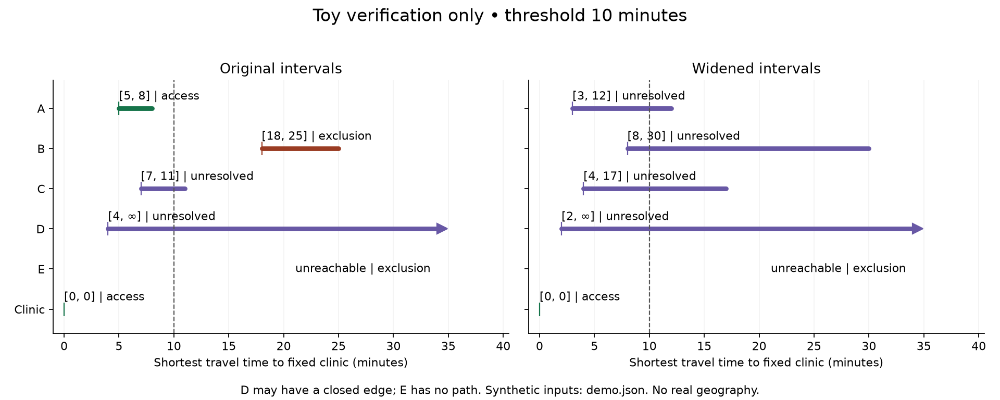

# Informal Road Mapping

Which healthcare-access decisions remain stable across credible road-time,
closure and facility uncertainty, and which observations resolve the most
consequential ambiguities per unit cost?

The first executed result verifies shortest-path interval bounds on **toy graphs**.
It does not measure access accuracy in any country. Global applicability is the
research question; geographic validation remains open.

[](https://github.com/500ft/informal-road-mapping/actions/workflows/ci.yml)

## Results so far

The [executed record](evidence/access-stability-20261006/result.json) reports
exhaustive small-graph checks, demonstration classifications and widening checks.
The [method](docs/ACCESS_STABILITY.md) states the assumptions and proof.



*Toy verification only. Dashed lines mark the demonstration threshold.
D has an optional edge; E has no path. Inputs, units and generator are in the
[figure guide](docs/data-and-figures.md). No real geography is shown.*

The [Idai qualification record](evidence/access-stability-20261006/qualification.json)
identifies a development baseline, checks its input links and records the
reproduction blockers. No published baseline has been reproduced here.
WFP observed constraints remain an unopened, currently ineligible evaluation
candidate. Metadata and eligibility are hashed before outcome access.

## Getting started

Use Python 3.10+ and the existing analysis dependencies:

```sh
python3 -m venv .venv
source .venv/bin/activate
python -m pip install -e "analysis[dev,baseline]"
MPLBACKEND=Agg PYTHONPATH=analysis python analysis/run_access_demo.py
PYTHONPATH=analysis python -m pytest analysis/tests -q
```

The demo reruns the exhaustive oracle and regenerates the result and figure.
It uses no network or reserved data. See [Start here](docs/START_HERE.md) for
metadata hashes and the retained detector checks.

## What's next

The [roadmap](ROADMAP.md) is the only plan. Real-area claims require licensed,
pinned development inputs and independently sourced bound families. The WFP
candidate also needs observation dates, vehicle scope and independent lineage
before evaluation can be registered at row level.

## Retained history

The owner adopted this software question in this repository. The detector track
is inactive and superseded, with its evidence retained; it was not scientifically
disproved. The [history index](docs/history/README.md) preserves the baseline
packet, code, dated QA reports, figures and previous questions. Its candidate
layers and holdout remain unopened.

The [UCI trip probe](evidence/route-feasibility-20261004/README.md) is a
non-Mongolian parser demonstration, not field validation. Its reported usable
trips establish neither observed healthcare access nor off-road passability.
No route-planning repository was created or renamed.

## License

Original code is [MIT](LICENSE). Third-party inputs retain their own terms,
including the [baseline packet's ODbL attribution](baseline/20261003/ATTRIBUTION.md).
No Idai GPL code is incorporated. A future combined derived program must meet
its applicable GPL obligations; placing it in a separate folder is insufficient.
See [qualification](evidence/access-stability-20261006/README.md) and
[contributing](CONTRIBUTING.md).
