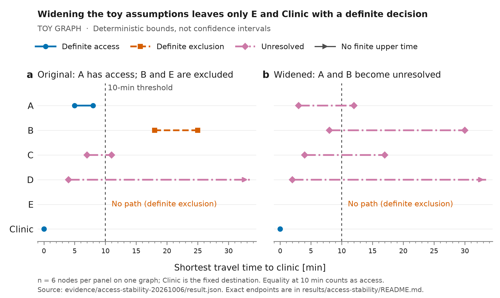

# Results

The executed result verifies deterministic travel-time bounds on a toy graph.
No real-area Idai baseline or independent WFP evaluation has been qualified.
[ROADMAP.md](../ROADMAP.md) remains the active plan.

*Times are minutes to a fixed clinic. These are deterministic assumptions, not
confidence intervals. An arrow means an unbounded upper time; no path is distinct
from missing data. No field accuracy is shown.*

- [Accessible bounds and qualification tables](access-stability/README.md)
- [Bounds CSV](access-stability/bounds.csv) and [qualification CSV](access-stability/qualification.csv)
- [SVG figure](access-stability/bounds.svg) and [render provenance](access-stability/provenance.json)
- [Original result and scientific reproduction](../evidence/access-stability-20261006/README.md)

Rebuild these views with `MPLBACKEND=Agg python analysis/plot_access_bounds.py`.
The [figure guide](../docs/data-and-figures.md) explains scales, encodings and retention.

The [acquired development input record](../evidence/idai-development-inputs/README.md)
updates source availability without claiming a real-area replication.

The detector JSON records, exports and figures in this directory are retained
history. Their [previous results index and reproduction runbook](../docs/history/detector-results.md)
remain available. No detector evaluation or holdout inspection is authorized by
the software pivot. The [history index](../docs/history/README.md) explains scope.
